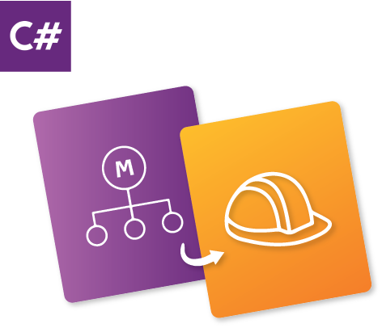
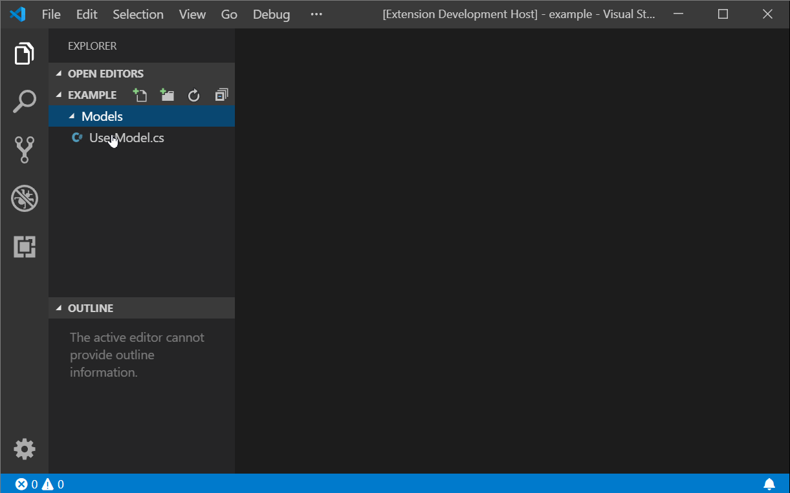

# C# Model to Builder Class

C# Model to Builder Class is a Visual Studio Code extension that will save you time by automatically generating a builder class from a C# model.

## Features

Stop wasting time manually writing out builder classes. Define a model and use this extension to generate your builder.



The generated file will be saved next to your model file with `Builder.cs` appended to the end of the original filename.

If you're not already using builders, you should start. They are a great way to easily generate data for your unit tests.

If you are using this extension and find any issues or wish to add improvements, feel free to [contribute](https://github.com/devshop/csharp-model-to-builder).

## Example

Here is an example of using the generated builder to create a user for a test scenario.

Start with a model that you have written.

**User.cs**

```
namespace MyProject.Models
{
    public class User
    {
      public string FirstName { get; set; }

      public string LastName { get; set; }

      public string Email { get; set; }

      public DateTime DateOfBirth { get; set; }
    }
}
```

Run the extension `Cmd/Ctrl + Shift + P => Generate Builder From C# Model`.

Manually update the generated file to take care of any required imports and set the default values.

Import the generated file into your test class.

To create a new user with the default values defined in the builder class use the following code.

```
var user = new UserBuilder().build()
```

If you want to override the default values you can specify unique values using `.With<PropertyName>(value)`.

```
var user = new UserBuilder()
  .WithFirstName('Bruce')
  .WithLastName('Wayne')
  .WithEmail('bruce.wayne@wayne-enterprises.com')
  .WithDateOfBirth(new DateTime(1970, 1, 1))
  .Build()
```

## Requirements

To use the extension:

- You must have a folder open in Visual Studio Code
- You must have a model file open
- Your model must include the text `public class`
- You need to have at least one `{ get; set; }` defined

## Known Issues

- Any required imports will have to be added manually after the builder is generated.
- Enums will have to be added manually
